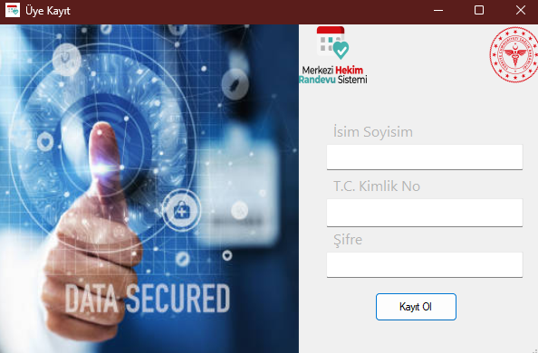
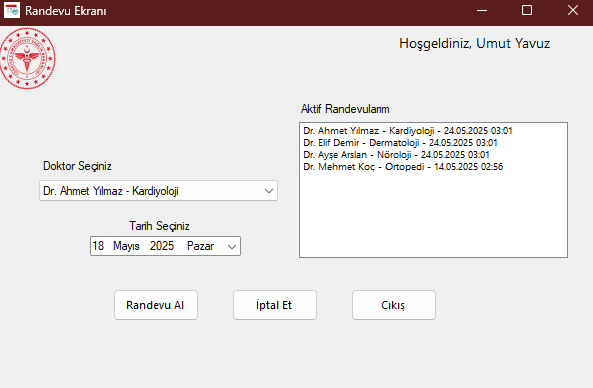
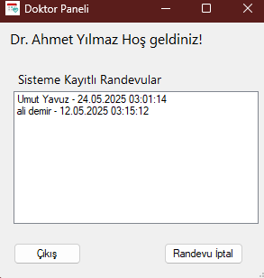

# 🏥 Hastane Randevu Sistemi

Bu proje, **C#** ve **SQL Server** kullanılarak geliştirilmiş basit bir *Hastane Randevu Sistemi* uygulamasıdır. Kullanıcılar (hastalar ve doktorlar) için temel randevu alma ve görüntüleme işlevlerini içerir. Küçük çaplı bir **MHRS kopyası** olarak düşünebilirsiniz.

## 📦 Kurulum

1. Projeyi bilgisayarınıza klonlayın veya indirin.
2. `DatabaseHelper.cs` dosyası içerisindeki `server` kısmını kendi bilgisayarınıza uygun şekilde düzenleyin.
3. Veritabanı `.bak` dosyası proje klasöründe mevcuttur. SQL Server Management Studio kullanarak bu yedeği içeri aktarabilirsiniz.

## 🧑‍⚕️ Özellikler

### Hasta Paneli

- TC Kimlik No ve şifre ile giriş yapılır.
- Doktorlar ve uzmanlık alanları görüntülenebilir.
- Uygun tarihe randevu alınabilir.
- Alınan randevular listelenebilir veya iptal edilebilir.

### Doktor Paneli

- Doktor giriş yaptıktan sonra **kendi hastaları** ve **randevu tarihleri** listelenir.
- İlgili randevular istenirse iptal edilebilir.

## 🖼️ Ekran Görüntüleri

### Hasta Giriş Ekranı

### Hasta Kayıt Ekranı

### Randevu Alma & Detayları

### Doktorun Randevular Ekranı

## 🛠️ Kullanılan Teknolojiler

- C# (.NET Framework - Windows Forms)
- SQL Server
- ADO.NET
- WinForms UI

## 📌 Notlar

- Bu proje eğitim amaçlı hazırlanmıştır.
- Gerçek sistemlerdeki güvenlik ve yetkilendirme önlemleri burada basitleştirilmiştir.

## 📄 Lisans

Bu proje kişisel ve eğitimsel kullanım için ücretsizdir. Ticari amaçla kullanılması yasaktır.
